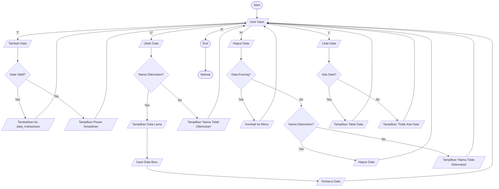

# Labpy6

# Deskripsi Program
Aplikasi Python untuk manajemen data mahasiswa yang memungkinkan pengguna melakukan operasi CRUD (Create, Read, Update, Delete) pada data mahasiswa.

# Struktur Program
## Komponen Utama
data_mahasiswa: Dictionary untuk menyimpan data mahasiswa
## Fungsi utama:
lihat_data(): Menampilkan data mahasiswa
tambah_data(): Menambah data mahasiswa baru
ubah_data(): Mengubah data mahasiswa
hapus_data(): Menghapus data mahasiswa
## Alur Kerja Program
Pengguna memilih menu (Tambah/Ubah/Hapus/Lihat/Keluar)
Program mengeksekusi fungsi sesuai pilihan
Data disimpan dalam dictionary data_mahasiswa
## Perhitungan Nilai
Nilai Akhir = (Tugas * 0.3) + (UTS * 0.35) + (UAS * 0.35)
Bobot:
Tugas: 30%
UTS: 35%
UAS: 35%
## Fitur Khusus
Validasi input mencegah duplikasi NIM
Fleksibilitas update data
Tampilan data dalam format tabel
Perhitungan otomatis nilai akhir
## Cara Penggunaan
Jalankan script
Pilih opsi menu:
T: Tambah data
U: Ubah data
H: Hapus data
L: Lihat data
K: Keluar program
## Flowchart


## Code
````python
data_mahasiswa = {}

def lihat_data():
    if not data_mahasiswa:
        print("Daftar Nilai")
        print("=" * 81)
        print(f"{'No'.center(5)}|{'Nama'.center(15)}|{'NIM'.center(10)}|{'Nilai Tugas'.center(13)}|{'Nilai UTS'.center(10)}|{'Nilai UAS'.center(10)}|{'Nilai Akhir'.center(10)}|")
        print("=" * 81)
        print(f"{'TIDAK ADA DATA'.center(75)}")
        print("=" * 81)
        return
    print("Daftar Nilai")
    print("=" * 81)
    print(f"{'No'.center(5)}|{'Nama'.center(15)}|{'NIM'.center(10)}|{'Nilai Tugas'.center(13)}|{'Nilai UTS'.center(10)}|{'Nilai UAS'.center(10)}|{'Nilai Akhir'.center(10)}|")
    print("=" * 81)
    for i, (nim, mhs) in enumerate(data_mahasiswa.items(), start=1):
        print(f"{str(i).center(5)}|{mhs['nama'].ljust(15)}|{nim.center(10)}|{str(mhs['tugas']).center(13)}|{str(mhs['uts']).center(10)}|{str(mhs['uas']).center(10)}|{format(mhs['nilai_akhir'], '.2f').center(10)}|")
    print("=" * 81)

def tambah_data():
    print("Tambah Data")
    nim = input("NIM: ")
    if nim in data_mahasiswa:
        print("Data dengan NIM tersebut sudah ada!")
        return
    nama = input("Nama: ")
    tugas = float(input("Nilai Tugas: "))
    uts = float(input("Nilai UTS: "))
    uas = float(input("Nilai UAS: "))
    nilai_akhir = (tugas * 0.3) + (uts * 0.35) + (uas * 0.35)

    data_mahasiswa[nim] = {
        "nama": nama,
        "tugas": tugas,
        "uts": uts,
        "uas": uas,
        "nilai_akhir": nilai_akhir
    }
    print("Data berhasil ditambahkan!")

def ubah_data():
    if not data_mahasiswa:
        return

    nama = input("Masukkan nama data yang akan diubah: ")
    for nim, mhs in data_mahasiswa.items():
        if mhs['nama'].lower() == nama.lower():
            # Tampilkan data yang ditemukan
            print("Data yang akan diubah:")
            print("=" * 81)
            print(f"{'No'.center(5)}|{'Nama'.center(15)}|{'NIM'.center(10)}|{'Nilai Tugas'.center(13)}|{'Nilai UTS'.center(10)}|{'Nilai UAS'.center(10)}|{'Nilai Akhir'.center(10)}|")
            print("=" * 81)
            print(f"{'1'.center(5)}|{mhs['nama'].ljust(15)}|{nim.center(10)}|{str(mhs['tugas']).center(13)}|{str(mhs['uts']).center(10)}|{str(mhs['uas']).center(10)}|{format(mhs['nilai_akhir'], '.2f').center(10)}|")
            print("=" * 81)

            # Masukkan data baru
            print("Masukkan Data Baru (tekan Enter jika tidak ingin mengubah nilai tertentu)")
            nim_baru = input("NIM : ").strip() or nim  # Gunakan NIM lama jika kosong
            nama_baru = input("Nama : ").strip() or mhs['nama']  # Gunakan nama lama jika kosong
            tugas = input("Nilai Tugas: ").strip()
            tugas = float(tugas) if tugas else mhs['tugas']
            uts = input("Nilai UTS : ").strip()
            uts = float(uts) if uts else mhs['uts']
            uas = input("Nilai UAS: ").strip()
            uas = float(uas) if uas else mhs['uas']
            nilai_akhir = (tugas * 0.3) + (uts * 0.35) + (uas * 0.35)

            # Perbarui data
            del data_mahasiswa[nim]  # Hapus data lama
            data_mahasiswa[nim_baru] = {
                "nama": nama_baru,
                "tugas": tugas,
                "uts": uts,
                "uas": uas,
                "nilai_akhir": nilai_akhir
            }
            print("Data berhasil diubah!")
            return
    print("Nama tidak ditemukan!")

def hapus_data():
    lihat_data()
    if not data_mahasiswa:
        return

    nama = input("Masukkan nama data yang akan dihapus: ")
    for nim, mhs in list(data_mahasiswa.items()):
        if mhs['nama'].lower() == nama.lower():
            del data_mahasiswa[nim]
            print("Data berhasil dihapus!")
            return
    print("Nama tidak ditemukan!")

while True:
    pilihan = input("[(L)ihat (T)ambah (U)bah (H)apus (K)eluar] : ").lower()
    if pilihan == 't':
        tambah_data()
    elif pilihan == 'u':
        ubah_data()
    elif pilihan == 'h':
        hapus_data()
    elif pilihan == 'l':
        lihat_data()
    elif pilihan == 'k':
        print("Program selesai.")
        break
    else:
        print("Pilihan tidak valid!")
````


